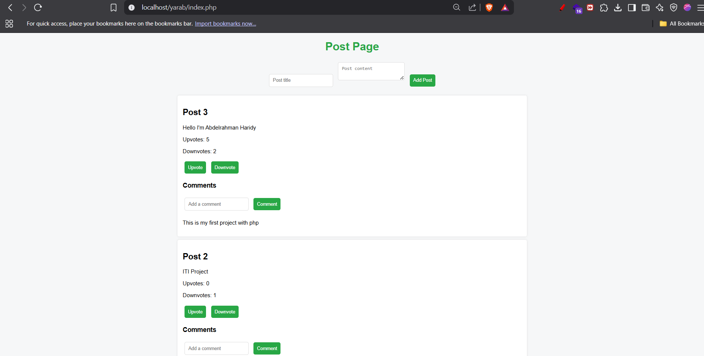

# Post-Page Forum

A lightweight PHP-based forum system that allows users to post content, comment, and upvote/downvote posts. Ideal as a starter project to understand basic CRUD operations, session handling, and database integration with PHP.

## 🌟 Features

- Create and display posts
- Comment on posts
- Upvote / Downvote system
- Basic styling with CSS
- JavaScript enhancements
- MySQL database integration

## 📁 Project Structure

- `index.php` — Main page displaying posts
- `add_post.php` — Handles new post submissions
- `add_comment.php` — Handles new comment submissions
- `comments.php` — Loads and displays comments
- `upvote.php` / `downvote.php` — Handles vote logic
- `db.php` — Database connection settings
- `database.sql` — SQL file to set up the database
- `style.css` — Page styling
- `script.js` — Basic interactivity

##📸 Preview



## 🚀 Getting Started

### Prerequisites

- PHP (>= 7.x)
- MySQL
- Web server (like Apache or XAMPP)

### Installation

1. Clone this repository:

```bash
git clone https://github.com/abdelrahmanharidyy/PostBox.git

